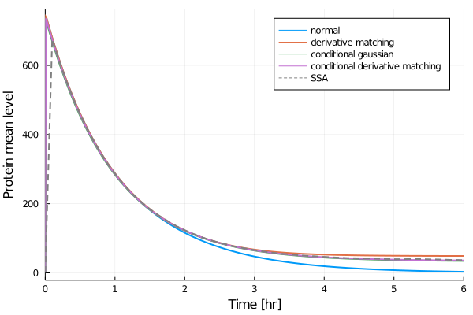
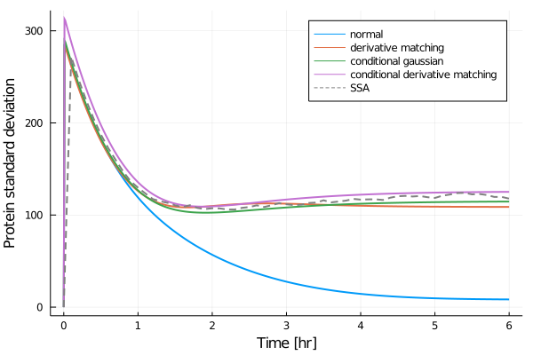
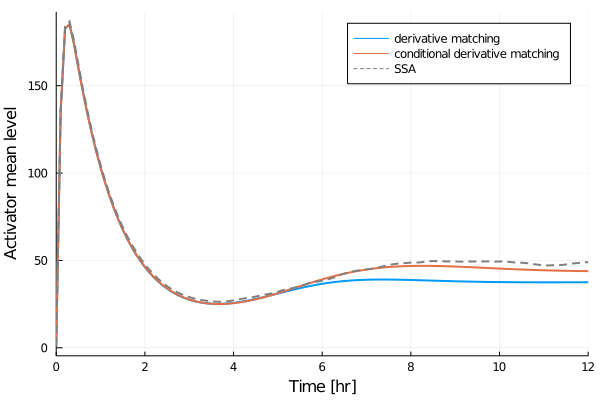
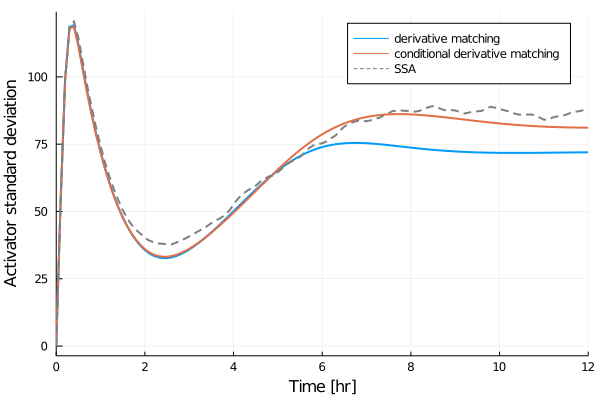

# [Geometrically Distributed Reaction Products and Conditional Closures](@id geometric-and-conditional)

In this tutorial, we demonstrate how MomentClosure's [`ReactionSystemMod`](@ref) type can be used to define chemical systems involving reactions which products are geometrically distributed random variables. As an example, we consider an autoregulatory (repressive) genetic feedback loop where proteins are expressed in bursts with a geometric burst size distribution, as described by Soltani et al. [1]. Moreover, the state of the gene is modelled as a binary variable—we demonstrate how conditional derivative matching and conditional gaussian closures can be used to approximate such systems, in turn reproducing a number of results from Ref. [1].

We consider a negative feedback loop described by the following reactions:
```math
\begin{align*}
G^* &\stackrel{k_{on}}{\rightarrow} G, \\
G + 2P &\stackrel{k_{off}}{\rightarrow} G^*, \\
G  &\stackrel{k_p}{\rightarrow} G + mP, \\
P &\stackrel{\gamma_p}{\rightarrow} ∅.
\end{align*}
```
A gene in the network switches between ON ($G$) and OFF ($G^{\\*}$) states: proteins are produced in the transcriptionally active ON state but the gene can be turned OFF by two protein molecules binding to the promoter region and thus blocking transcription (proteins decay at a constant rate irrespective of the gene state). Note that the gene state can be interpreted as a distinct species that have either zero or one copy number per cell. In other words, it is a Bernoulli random variable: $0$ in the OFF state and $1$ in the ON state.

The transcription (mRNA) dynamics are not modelled explicitly in this gene circuit. Instead, under the assumption of fast mRNA decay, proteins are taken to be produced in bursts of size $m$, where $m$ is a random variable sampled from the geometric distribution $\phi(m) = b^m/(1+b)^{m+1}$ (with $b$ denoting the mean burst size) [2]. However, chemical reaction networks that include reactions which products are independent geometrically distributed random variables cannot be defined using [Catalyst](https://github.com/SciML/Catalyst.jl) (allowing them is [currently being considered](https://github.com/SciML/Catalyst.jl/issues/308)). As a temporary solution, we have added (limited) support for such systems: they can be constructed as a [`ReactionSystemMod`](@ref) by defining the net stoichiometry matrix and the corresponding reaction propensity functions. As in Catalyst, the model specification is based on the rich symbolic-numeric modelling framework provided by [ModelingToolkit.jl](https://github.com/SciML/ModelingToolkit.jl). Note that we have to explicitly define the molecule numbers of each chemical species as [`Symbolics.@variables`](@ref) and reaction constants as [`ModelingToolkit.@parameters`](@ref). The time, $t$, must also be initialised as a `ModelingToolkit.parameter` and used to indicate the time-dependence of species' molecule numbers. Finally, in order to indicate that a certain reaction product is geometrically distributed, the corresponding stoichiometric matrix element must be a `ModelingToolkit.parameter` specifying the mean of the distribution.

Using `ReactionSystemMod`, our gene network model can be constructed as follows:
```julia
# load all the packages we will need
using MomentClosure, DiffEqJump, OrdinaryDiffEq, DiffEqBase.EnsembleAnalysis, Plots, Latexify

@parameters t, k_on, k_off, k_p, γ_p, b
@variables g(t), p(t)

# species (g - gene state, p - protein number)
vars = [g, p]

# parameters (b - the mean burst size)
ps = [k_on, k_off, k_p, γ_p, b]

# net stoichiometry matrix
S_mat = [1 -1 0 0;
         0 0 b -1]

# propensity functions
as = [k_on*(1-g),    # G* -> G
      k_off*g*(p^2), # G + 2P -> G*
      k_p*g,         # G -> G + mP, m ~ Geometric(mean=b)
      γ_p*p]         # P -> ∅

rn = ReactionSystemMod(t, vars, ps, as, S_mat)
```
Following Soltani et al. [1], we define all model parameters as:
```julia
mean_p = 200
mean_b = 70
γ_p_val = 1
k_off_val = 0.001
k_on_val = 0.05

k_p_val = mean_p * γ_p_val * (k_off_val * mean_p^2 + k_on_val) / (k_on_val * mean_b)

# parameter mapping
pmap = [k_on => k_on_val,
        k_off => k_off_val,
        k_p => k_p_val,
        γ_p => γ_p_val,
        b => mean_b]

# initial gene state and protein number, order [g, p]
u₀ = [1, 1]

# time interval to solve on
tspan = (0., 6.0)
```
[`ReactionSystemMod`](@ref) [can be converted](@ref stochastic_simulation_utilities) to the usual DifferentialEquations `JumpProblem` and hence simulated using SSA:
```julia
# create a discrete problem setting the simulation parameters
dprob = DiscreteProblem(u₀, tspan, pmap)

# create a JumpProblem compatible with ReactionSystemMod
jprob = JumpProblem(rn, dprob, Direct(), save_positions=(false, false))

# simulate 2×10⁴ SSA trajectories
ensembleprob  = EnsembleProblem(jprob)
@time sol_SSA = solve(ensembleprob, SSAStepper(), saveat=0.1, trajectories=20000)
# compute the means and variances
means_ssa, vars_ssa = timeseries_steps_meanvar(sol_SSA)
```
```julia
23.200118 seconds (153.85 M allocations: 5.486 GiB, 31.19% gc time)
```
We can now generate the raw moment equations up to third order:
```julia
eqs = generate_raw_moment_eqs(rn, 3)
latexify(eqs)
```
```math
\begin{align*}
\frac{d\mu{_{10}}}{dt} =& k_{on} - k_{off} \mu{_{12}} - k_{on} \mu{_{10}} \\
\frac{d\mu{_{01}}}{dt} =& b k_{p} \mu{_{10}} - \gamma_{p} \mu{_{01}} \\
\frac{d\mu{_{20}}}{dt} =& k_{on} + k_{off} \mu{_{12}} + k_{on} \mu{_{10}} - 2 k_{off} \mu{_{22}} - 2 k_{on} \mu{_{20}} \\
\frac{d\mu{_{11}}}{dt} =& k_{on} \mu{_{01}} + b k_{p} \mu{_{20}} - k_{off} \mu{_{13}} - k_{on} \mu{_{11}} - \gamma_{p} \mu{_{11}} \\
\frac{d\mu{_{02}}}{dt} =& \gamma_{p} \mu{_{01}} + b k_{p} \mu{_{10}} + 2 b k_{p} \mu{_{11}} + 2 k_{p} \mu{_{10}} b^{2} - 2 \gamma_{p} \mu{_{02}} \\
\frac{d\mu{_{30}}}{dt} =& k_{on} + 3 k_{off} \mu{_{22}} + 2 k_{on} \mu{_{10}} - k_{off} \mu{_{12}} - 3 k_{off} \mu{_{32}} - 3 k_{on} \mu{_{30}} \\
\frac{d\mu{_{21}}}{dt} =& k_{off} \mu{_{13}} + k_{on} \mu{_{01}} + k_{on} \mu{_{11}} + b k_{p} \mu{_{30}} - 2 k_{off} \mu{_{23}} - 2 k_{on} \mu{_{21}} - \gamma_{p} \mu{_{21}} \\
\frac{d\mu{_{12}}}{dt} =& k_{on} \mu{_{02}} + \gamma_{p} \mu{_{11}} + b k_{p} \mu{_{20}} + 2 b k_{p} \mu{_{21}} + 2 k_{p} \mu{_{20}} b^{2} - k_{off} \mu{_{14}} - k_{on} \mu{_{12}} - 2 \gamma_{p} \mu{_{12}} \\
\frac{d\mu{_{03}}}{dt} =& b k_{p} \mu{_{10}} + 3 \gamma_{p} \mu{_{02}} + 3 b k_{p} \mu{_{11}} + 3 b k_{p} \mu{_{12}} + 6 k_{p} \mu{_{10}} b^{2} + 6 k_{p} \mu{_{10}} b^{3} + 6 k_{p} \mu{_{11}} b^{2} - \gamma_{p} \mu{_{01}} - 3 \gamma_{p} \mu{_{03}}
\end{align*}
```
A lot of information in this system of ODEs is redundant as the gene state is a Bernoulli variable that (in our case) has the following properties:
```math
\begin{align*}
μ_{j0} &= μ_{10}, \quad j \in {2, 3, \dotsc}, \\
μ_{jk} &= μ_{1k}, \quad j,k \in {1, 2, 3, \dotsc}
\end{align*}
```
We can *clean* the moment equations accordingly by specifying which molecule numbers are Bernoulli variables and using the [`bernoulli_moment_eqs`](@ref) function:
```julia
# specify the indices of species which molecule numbers are binary
binary_vars = [1]
# simplify the moment equations using properties of Bernoulli variables
clean_eqs = bernoulli_moment_eqs(eqs, binary_vars)
latexify(clean_eqs)
```
```math
\begin{align*}
\frac{d\mu{_{10}}}{dt} =& k_{on} - k_{off} \mu{_{12}} - k_{on} \mu{_{10}} \\
\frac{d\mu{_{01}}}{dt} =& b k_{p} \mu{_{10}} - \gamma_{p} \mu{_{01}} \\
\frac{d\mu{_{11}}}{dt} =& k_{on} \mu{_{01}} + b k_{p} \mu{_{10}} - k_{off} \mu{_{13}} - k_{on} \mu{_{11}} - \gamma_{p} \mu{_{11}} \\
\frac{d\mu{_{02}}}{dt} =& \gamma_{p} \mu{_{01}} + b k_{p} \mu{_{10}} + 2 b k_{p} \mu{_{11}} + 2 k_{p} \mu{_{10}} b^{2} - 2 \gamma_{p} \mu{_{02}} \\
\frac{d\mu{_{12}}}{dt} =& k_{on} \mu{_{02}} + \gamma_{p} \mu{_{11}} + b k_{p} \mu{_{10}} + 2 b k_{p} \mu{_{11}} + 2 k_{p} \mu{_{10}} b^{2} - k_{off} \mu{_{14}} - k_{on} \mu{_{12}} - 2 \gamma_{p} \mu{_{12}} \\
\frac{d\mu{_{03}}}{dt} =& b k_{p} \mu{_{10}} + 3 \gamma_{p} \mu{_{02}} + 3 b k_{p} \mu{_{11}} + 3 b k_{p} \mu{_{12}} + 6 k_{p} \mu{_{10}} b^{2} + 6 k_{p} \mu{_{10}} b^{3} + 6 k_{p} \mu{_{11}} b^{2} - \gamma_{p} \mu{_{01}} - 3 \gamma_{p} \mu{_{03}}
\end{align*}
```
The system of ODEs is now much simpler and we can see that there are two higher-order moments we need to truncate: $\mu_{13}$ and $μ_{14}$. We consider normal, derivative matching, conditional gaussian and conditional derivative matching closures to see how well they compare. First we apply different closures and print out the corresponding higher-order moment expressions in order to check that our results are consistent with those published in [1].

For normal closure:
```julia
normal_eqs = moment_closure(eqs, "normal", binary_vars)
latexify(normal_eqs, :closure)
```
```math
\begin{align*}
\mu{_{13}} =& \mu{_{03}} \mu{_{10}} + 3 \mu{_{01}} \mu{_{12}} + 3 \mu{_{02}} \mu{_{11}} + 6 \mu{_{10}} \mu{_{01}}^{3} - 6 \mu{_{11}} \mu{_{01}}^{2} - 6 \mu{_{01}} \mu{_{02}} \mu{_{10}} \\
\mu{_{14}} =& \mu{_{04}} \mu{_{10}} + 4 \mu{_{01}} \mu{_{13}} + 6 \mu{_{02}} \mu{_{12}} + 4 \mu{_{03}} \mu{_{11}} + 24 \mu{_{11}} \mu{_{01}}^{3} + 36 \mu{_{02}} \mu{_{10}} \mu{_{01}}^{2} - 24 \mu{_{10}} \mu{_{01}}^{4} - 6 \mu{_{10}} \mu{_{02}}^{2} - 12 \mu{_{12}} \mu{_{01}}^{2} - 24 \mu{_{01}} \mu{_{02}} \mu{_{11}} - 8 \mu{_{01}} \mu{_{03}} \mu{_{10}}
\end{align*}
```
Note that our expression for $μ_{14}$ is different from the equivalent $\langle gp^4 \rangle$ in Eq. (8) of [1] as it seems that the authors introduced a mistake considering the central moment and cumulant relationship in Eq. (7).

Using derivative matching, we obtain:
```julia
dm_eqs = moment_closure(eqs, "derivative matching", binary_vars)
latexify(dm_eqs, :closure)
```
```math
\begin{align*}
\mu{_{13}} =& \mu{_{03}} \mu{_{10}} \mu{_{01}}^{3} \mu{_{02}}^{-3} \mu{_{11}}^{-3} \mu{_{12}}^{3} \\
\mu{_{14}} =& \mu{_{04}} \mu{_{01}}^{-4} \mu{_{02}}^{6} \mu{_{03}}^{-4} \mu{_{10}}^{-1} \mu{_{11}}^{4} \mu{_{12}}^{-6} \mu{_{13}}^{4}
\end{align*}
```
For conditional gaussian closure:
```julia
cond_gaussian_eqs = moment_closure(eqs, "conditional gaussian", binary_vars)
latexify(cond_gaussian_eqs, :closure)
```
```math
\begin{align*}
\mu{_{13}} =& 3 \mu{_{11}} \mu{_{12}} \mu{_{10}}^{-1} - 2 \mu{_{10}}^{-2} \mu{_{11}}^{3} \\
\mu{_{14}} =& 3 \mu{_{10}}^{-1} \mu{_{12}}^{2} + 6 \mu{_{10}}^{-3} \mu{_{11}}^{4} + 4 \mu{_{11}} \mu{_{13}} \mu{_{10}}^{-1} - 12 \mu{_{12}} \mu{_{10}}^{-2} \mu{_{11}}^{2}
\end{align*}
```
And, finally, for conditional derivative matching:
```julia
cond_dm_eqs = moment_closure(eqs, "conditional derivative matching", binary_vars)
latexify(cond_dm_eqs, :closure)
```
```math
\begin{align*}
\mu{_{13}} =& \mu{_{10}} \mu{_{11}}^{-3} \mu{_{12}}^{3} \\
\mu{_{14}} =& \mu{_{10}}^{-1} \mu{_{11}}^{4} \mu{_{12}}^{-6} \mu{_{13}}^{4}
\end{align*}
```
All these results are consistent with [1], reassuring that the model and closures are implemented as intended. Finally, we can solve the resulting ODEs and compare the resulting means and standard deviations of the protein number:
```julia
plt_m = plot()   # plot mean protein number
plt_std = plot() # plot ssd of protein number

# construct the initial molecule number mapping
u₀map = deterministic_IC(u₀, dm_eqs)

# solve moment ODEs for each closure and plot the results
for closure in ["normal", "derivative matching",
                "conditional gaussian", "conditional derivative matching"]

    # it is very quick so we just apply all closures again
    closed_eqs = moment_closure(eqs, closure, binary_vars)

    # solve the system of moment ODEs
    oprob = ODEProblem(closed_eqs, u₀map, tspan, pmap)
    sol = solve(oprob, AutoTsit5(Rosenbrock23()), saveat=0.01)

    # μ₀₁ is 2nd and μ₀₂ is 4th element in sol
    # can check the order with `closed_eqs.odes.states`
    plt_m = plot!(plt_m, sol, vars=(0, 2), label=closure)
    plt_std = plot!(plt_std, sol.t, sqrt.(sol[4, :] .- sol[2, :].^2), label=closure)

end

plt_m = plot!(plt_m, xlabel="Time [hr]", ylabel="Protein mean level")
plt_m = plot!(plt_m, means_ssa.t, means_ssa[2,:], label="SSA", linestyle=:dash, color="gray")
plt_std = plot!(plt_std, xlabel="Time [hr]", ylabel="Protein standard deviation")
plt_std = plot!(plt_std, vars_ssa.t, sqrt.(vars_ssa[2,:]), label="SSA", linestyle=:dash, color="gray")
```
```julia
plot(plt_m, lw=2)
```


```julia
plot(plt_std, lw=2)
```


We observe that the two conditional closures give the most accurate results. Therefore, closing moments conditioned on the gene being active is an effective approximation in this case. Note that our results for normal closure are different from [1], most likely due to the incorrect fifth-order moment closure function given in the paper.

We now turn to a more complex network involving two genes (two Bernoulli variables), a repressor-activator circuit: an activator protein $Y$ expressed by one gene can turn ON another gene which produces a repressor protein $X$, that subsequently can bind to the gene promoter region of the activator-producing gene turning it OFF (see [1] for more details). As before, $X$ and $Y$ proteins are expressed in geometrically-distributed bursts. The system can be specified as follows:
```julia
@parameters t, kx_on, kx_off, ky_on, ky_off, γ_x, γ_y, k_x, k_y, b_x, b_y
@variables x(t), y(t), g_x(t), g_y(t)

# g_x - gene state of X protein producing gene
# g_y - gene state of Y protein producing gene
# x, y - proteins X and Y
vars = [g_x, g_y, x, y]

# both g_x and g_y are Bernoulli random variables
binary_vars = [1, 2]

ps = [kx_on, kx_off, ky_on, ky_off, γ_x, γ_y, k_x, k_y, b_x, b_y]

# b_x and b_y denote the mean burst sizes for gene production in geometrically-distributed bursts
S = [1 -1  0  0  0    0  0    0;
     0  0  1 -1  0    0  0    0;
     0  0  0  0  b_x -1  0    0;
     0  0  0  0  0    0  b_y -1]

as = [kx_on*(1-g_x)*y,    # 0   -> g_x
      kx_off*g_x,         # g_x -> 0
      ky_on*(1-g_y),      # 0   -> g_y
      ky_off*g_y*x,       # g_y -> 0
      k_x*g_x,            # 0   -> mx, m ~ Geometric(mean=b_x)     
      γ_x*x,              # x   -> 0
      k_y*g_y,            # 0   -> ly, l ~ Geometric(mean=b_y)
      γ_y*y]              # y   -> 0

rn = ReactionSystemMod(t, vars, ps, as, S)

# Parameter initialisation

mean_x = 100
mean_y = 100
mean_b_x = 5
mean_b_y = 5
γ_x_val = 1
γ_y_val = 1
kx_off_val = 4
ky_on_val = 0.3
kx_on_val = 0.05
ky_off_val = 0.05

k_x_val = mean_x * γ_x_val * (kx_off_val * mean_y^2 + kx_on_val) / (kx_on_val * mean_b_x)
k_y_val = mean_y * γ_y_val * (ky_off_val * mean_x^2 + ky_on_val) / (ky_on_val * mean_b_y)

# unclear if Soltani et al. (2015) actually used this parameter set as X numbers
# jump to millions making SSA extremely slow...

# introduce additional rescaling (otherwise rate coefficients are too high)
k_x_val *= 0.00003
k_y_val *= 0.01

# parameter mapping
pmap = [kx_on => kx_on_val,
        kx_off => kx_off_val,
        ky_on => ky_on_val,
        ky_off => ky_off_val,
        k_x => k_x_val,
        k_y => k_y_val,
        γ_x => γ_x_val,
        γ_y => γ_y_val,
        b_x => mean_b_x,
        b_y => mean_b_y]

# initial gene state and protein number, order [g_x, g_y, x, y]
u₀ = [1, 1, 1, 1]

# time interval to solve on
tspan = (0., 12.0)
```
Note that here we use a different parameter set from the one considered in [1] as otherwise the number of $X$ proteins goes into millions, making the comparison between closure results difficult due to SSA being extremely slow—it appears that either we have included a mistake setting the parameter values or there is a typo in the paper.

We can run SSA as follows:
```julia
dprob = DiscreteProblem(u₀, tspan, pmap)
jprob = JumpProblem(rn, dprob, Direct(), save_positions=(false, false))

ensembleprob  = EnsembleProblem(jprob)
@time sol_SSA = solve(ensembleprob, SSAStepper(), saveat=0.1, trajectories=20000)
means_ssa, vars_ssa = timeseries_steps_meanvar(sol_SSA)
```
```julia
959.286216 seconds (3.43 G allocations: 107.662 GiB, 64.66% gc time)
```
We use fourth order moment expansion and apply different closure methods as done for the negative feedback loop, considering the number of activator proteins $Y$ and its standard deviation:
```julia
plt_m = plot()   # plot mean activator protein number
plt_std = plot() # plot ssd of activator protein number

for closure in ["derivative matching", "conditional derivative matching"]

    closed_eqs = moment_closure(eqs, closure, binary_vars)

    u₀map = deterministic_IC(u₀, closed_eqs)
    oprob = ODEProblem(closed_eqs, u₀map, tspan, pmap)
    sol = solve(oprob, Tsit5(), saveat=0.1)

    # μ₀₀₀₁ is the 4th and μ₀₀₀₂ is the 12th element in sol (can check with closed_eqs.odes.states)
    plt_m = plot!(plt_m, sol, vars=(0, 4), label=closure)
    plt_std = plot!(plt_std, sol.t, sqrt.(sol[12, :] .- sol[4, :].^2), label=closure)
end

plt_m = plot!(plt_m, xlabel="Time [hr]", ylabel="Activator mean level")
plt_m = plot!(plt_m, means_ssa.t, means_ssa[4,:], label="SSA", linestyle=:dash, color="gray")
plt_std = plot!(plt_std, xlabel="Time [hr]", ylabel="Activator standard deviation")
plt_std = plot!(plt_std, vars_ssa.t, sqrt.(vars_ssa[4,:]), label="SSA", linestyle=:dash, color="gray")
```
Note that here we apply only derivative matching and conditional derivative matching, as both normal and conditional gaussian closures failed to be evaluated for the entire time course (irrespective of the solver used). Finally, we can plot the results:

```julia
plot(plt_m, lw=2)
```


```julia
plot(plt_std, lw=2, xlims=(0., 12.))
```


The trajectories obtained with conditional derivative matching quite accurately match the true dynamics, showing that it is indeed a powerful closure method for reaction networks involving species with very low (binary) copy numbers.

## References

[1]: M. Soltani, C. A. Vargas-Garcia, and A. Singh, "Conditional Moment Closure Schemes for Studying Stochastic Dynamics of Genetic Circuits", IEEE Transactions on Biomedical Circuits and Systems 9, 518–526 (2015). [https://doi.org/10.1109/tbcas.2015.2453158](https://doi.org/10.1109/tbcas.2015.2453158)

[2]: D. Schnoerr, G. Sanguinetti, and R. Grima, "Approximation and inference methods for stochastic biochemical kinetics - a tutorial review", Journal of Physics A: Mathematical and Theoretical 50, 093001 (2017). [https://doi.org/10.1088/1751-8121/aa54d9](https://doi.org/10.1088/1751-8121/aa54d9)
